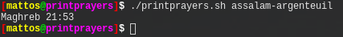
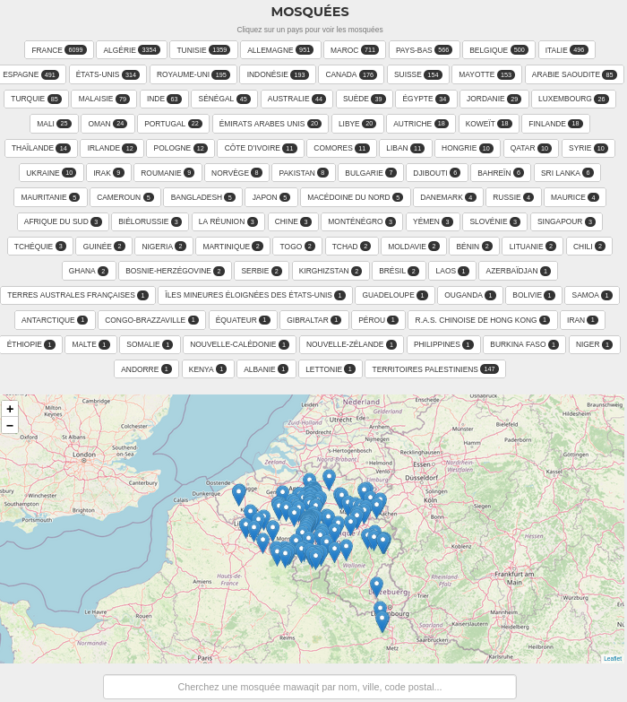
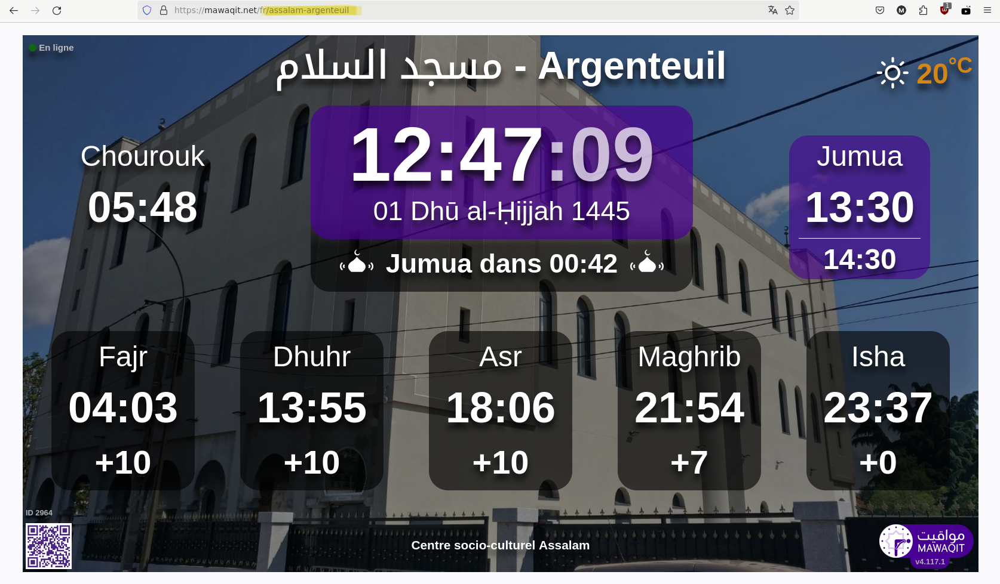

# printprayers



printprayers is an application that allows any user to display the next prayer time in the mosque of your choice.

## Prerequisites

Before using printprayers, ensure you have the API server running locally. You can find the API project at [mawaqit-api](https://github.com/mrsofiane/mawaqit-api).<br>Follow the instructions provided there to set up and run the API server.

## Installation 

```bash
git clone https://github.com/M-Arnone/printprayers.git
cd printprayers
chmod +x printprayers.sh
```

## Utilisation

```bash
./printprayers.sh <mosque> 
```

<mosque> is a variable that contains your mosque's ID.

## Mosque's ID

<div style="text-align: center;">
    
</div>

- Visit [mawaqit](https://mawaqit.net/) 
- Select your country
- Find your mosque
    > Note: The search function is currently unavailable. A fix is in progress.


Once found, your mosque's ID will be visible on the page, corresponding to what is highlighted.
<div style="text-align: center;">
    
</div>

For example, for the Assalam Mosque in Argenteuil, the ID is `assalam-argenteuil` .

## License
printprayers is licensed under the GNU General Public License v3.0 (GPL-3.0). See the LICENSE file for details.

## Contact
For any questions or suggestions, feel free to contact me via email at [matteoarnone2001@gmail.com](mailto:matteoarnone2001@gmail.com).

